# Project Overview

This project provides a smooth and user-friendly way for individuals to generate personalized PDF documents directly from a web application—without the need for manual PDF editing or backend server management. The system follows a fully **serverless architecture** built with various **AWS services**, ensuring high scalability, security, and cost-efficiency.

When a user accesses the website, they are served a fast and responsive frontend through **Amazon CloudFront**, which delivers static content like `index.html` and `script.js` from an **S3 bucket**. After the user fills out a form with resume details (e.g., name, education, experience), the frontend **JavaScript** gathers the input and formats it into a **JSON** object.

This **JSON** data is sent via a **POST** request to an **API Gateway** endpoint. The API Gateway securely routes the request to an **AWS Lambda** function, where the core logic is executed.

Inside the Lambda function, the data is used to generate an HTML resume using a template generator. Then, **Puppeteer**—a powerful **Node.js** library for headless browser automation—is used to convert the HTML into a high-quality **PDF** file, all within the serverless Lambda environment.

Once the PDF is generated, it is uploaded to an **S3 bucket**. The Lambda function then creates a **presigned URL**—a secure, time-limited link that allows the user to access and download the PDF without authentication.

This URL is returned to the frontend through **API Gateway**. The **JavaScript** code on the client side opens the PDF in a new browser tab, enabling the user to view or download it instantly.

By integrating **CloudFront**, **S3**, **API Gateway**, **Lambda**, and **Puppeteer**, this architecture delivers a reliable, scalable, and truly **serverless solution** for real-time PDF generation and delivery.

# Architecture Flow

1.  A user accesses the website through **Amazon CloudFront**, which serves static assets such as `index.html` and `script.js` from an **S3 bucket**.
2.  The user fills out the form on the website and clicks the **"Generate PDF"** button.
3.  The `script.js` file collects the form data using **JavaScript** and formats it as a **JSON object**.
4.  This JSON data is sent to an **API Gateway endpoint** via a **POST** request.
5.  **API Gateway** receives the request and triggers the corresponding **AWS Lambda** function (e.g., `index.js`).
6.  The Lambda function processes the JSON data and uses **Puppeteer** (via your `generateResumeHtml` function) to dynamically generate an **HTML** version of the resume.
7.  **Puppeteer** renders the HTML and converts it into a **PDF document**.
8.  The Lambda function uploads the generated PDF to a specified **S3 bucket**.
9.  Upon successful upload, the Lambda function creates a **presigned URL** for secure, temporary access to the PDF stored in S3.
10. The Lambda function returns a **JSON response** containing the presigned URL via **API Gateway** back to the frontend.
11. On the frontend, `script.js` extracts the URL from the response and opens the PDF in a new browser tab, allowing the user to view or download the document.

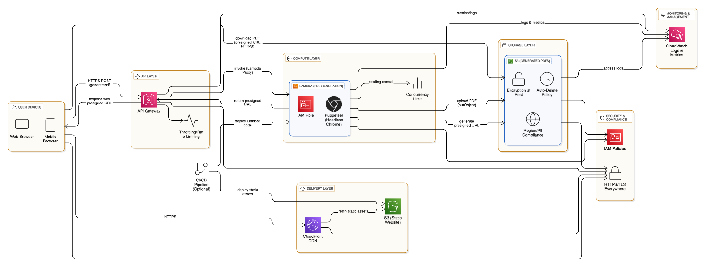

# Deployment & Configuration Guide

## Create S3 Buckets

**Purpose:** Two S3 buckets are required — one for storing the website files and another for storing the generated PDF documents.

*   **1st Bucket Name:** `aws-resume-builder-frontend`
    *   **Configuration:** `Block all public access: OFF`

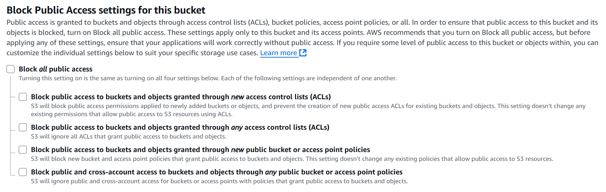

**Enable Static Website Hosting:**

1.  Go to the S3 Console and select your frontend bucket (e.g., `resume-builder-frontend`).
2.  Click on the **Properties** tab.
3.  Scroll down to the **Static website hosting** section (usually Disabled).
4.  Click the **Edit** button.
5.  Under **Static website hosting**, select the **Enable** option.
6.  In the **Index document** field, enter: `index.html`
7.  Click **Save changes**.

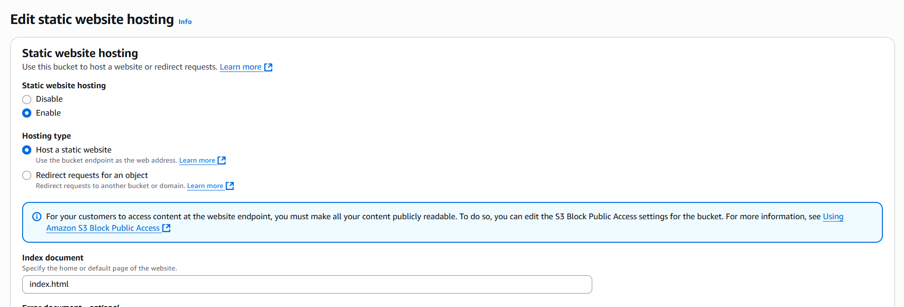

**Add a Public Read Bucket Policy**
**Important Note:**
Even if **Block all public access** is disabled, you must add a bucket policy to allow public read access to your website files.

**Steps:**

1.  Go to the S3 Console and open your frontend bucket (`resume-builder-frontend`).
2.  Click on the **Permissions** tab.
3.  Scroll down to the **Bucket policy** section.
4.  Click **Edit**.
5.  Copy and paste the following JSON policy:

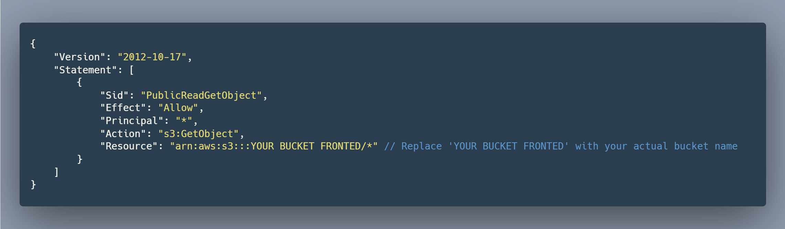

6.  Click “Save changes”.

Once these two steps are completed, your **S3 bucket** will be fully ready to function as a **static website.**
Then upload the frontend code in this bucket.

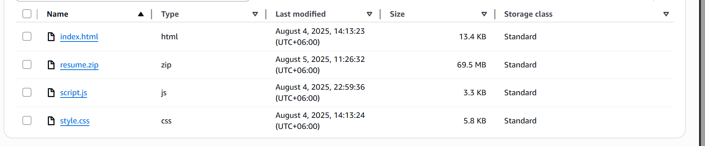

*   **2nd Bucket Name:** `aws-resume-builder-pdfs`
    *   **Configuration:** `Block all public access: OFF`

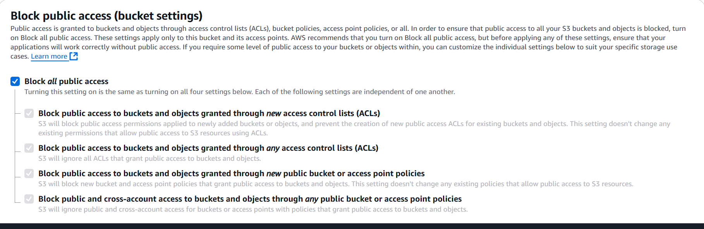

## IAM Role & Policy Configuration

**Purpose:** To assign necessary permissions to Lambda for accessing S3 and writing logs to CloudWatch.

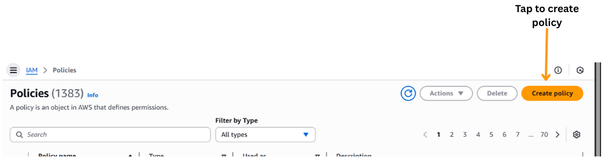

**For S3 Permissions:**

*   **Service:** `S3`
*   **Actions:**
    *   `s3:PutObject`
    *   `s3:GetObject`

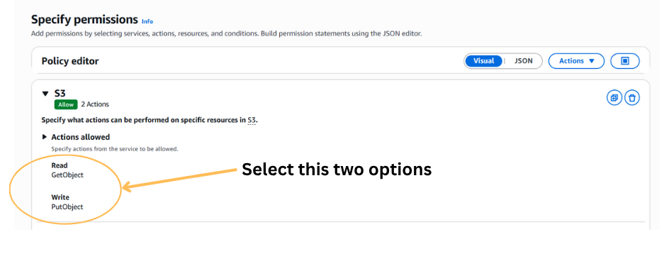

**In resource:**

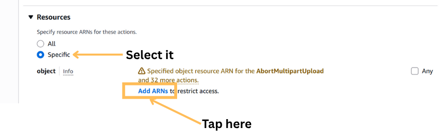

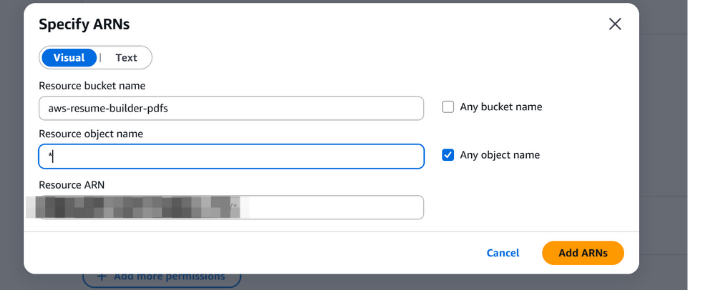

Here I also provide the **JSON code:**

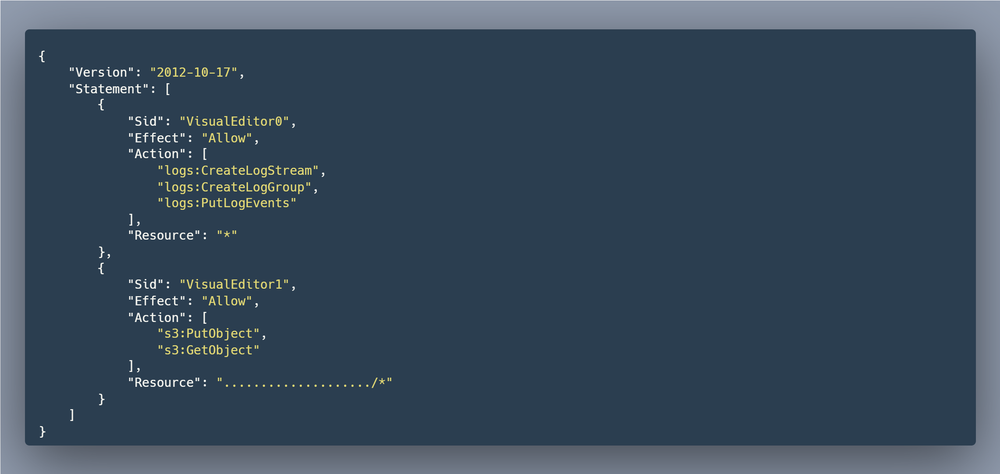

**Final Overview**

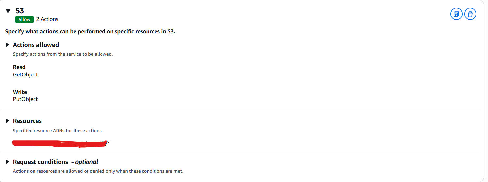

**For CloudWatch Logs Permissions:**

*   `logs:CreateLogGroup`
*   `logs:CreateLogStream`
*   `logs:PutLogEvents`

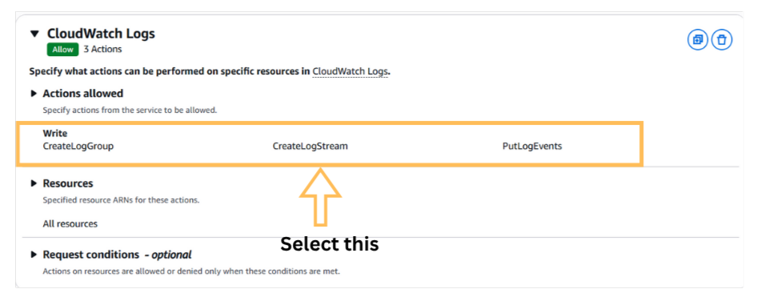

**Final Steps:**

*   Save the policy with the name: `ResumeBuilderLambdaPolicy`
*   Navigate to **Roles** in IAM and click on **Create Role**
*   Select the **Lambda** use case
*   Attach the `ResumeBuilderLambdaPolicy` to this role
*   Name the role: `ResumeBuilderLambdaRole`

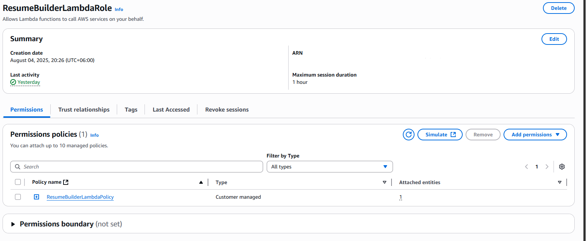

## Lambda Function Setup

**Purpose:** To generate a PDF from submitted form data and upload it to an S3 bucket.

*   Go to the **AWS Console** → **Lambda** → **Create Function**

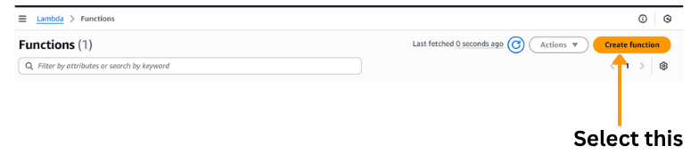

*   Choose **Author from scratch**

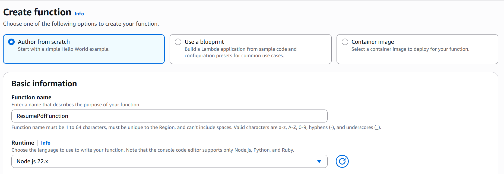

*   Enter a function name (e.g., `ResumePdfFunction`)
*   Select the appropriate **Runtime** (e.g., Node.js 22.x)
*   Click **Create Function**

**Permissions:** Attach the IAM role named `ResumeBuilderLambdaRole` to your Lambda function.

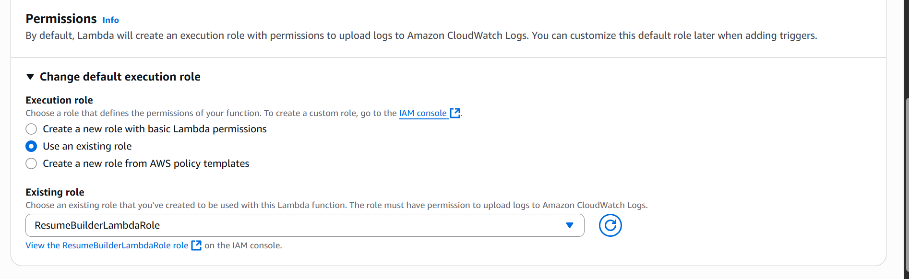

**Add Environment Variable to Lambda Function:**
To allow your Lambda function to dynamically access the PDF bucket name:

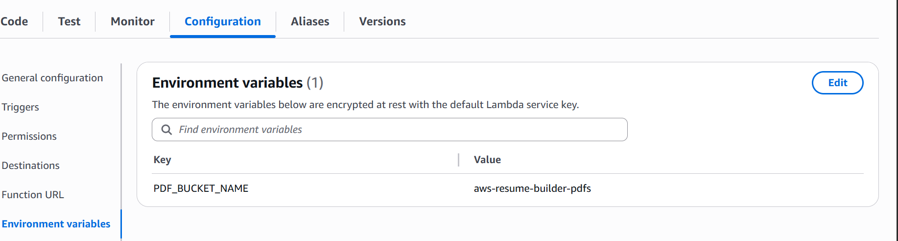

## API Gateway Integration

**Purpose:** It will create a secure HTTP endpoint between my frontend and the Lambda function.
This endpoint will receive `POST` requests from my website’s `script.js` file
and forward the data to the Lambda function for processing.

### Create the API

1.  In the AWS Console, I go to **API Gateway** → **Create API** → **REST API** → **Build**.

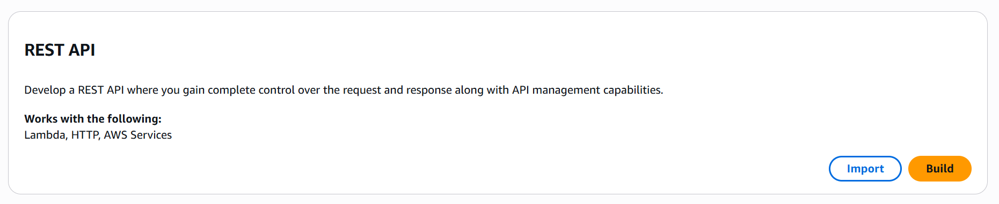

2.  I set **Name**: `ResumeApi`.
3.  From the **Actions** menu → **Create Resource**.

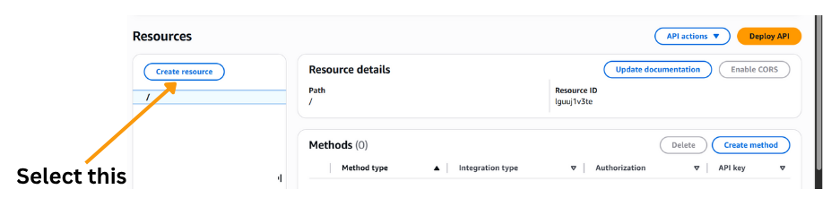

4.  **Resource Name**: `generate`.

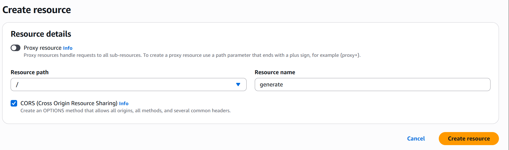

5.  Click **Create Resource** to add a new resource (e.g., `/generate-pdf`) in API Gateway, which will serve as the HTTP endpoint path.

### Create Method and Integrate with Lambda

1.  Select the newly created resource `/generate` from the left panel.
2.  Click **Create Method**.

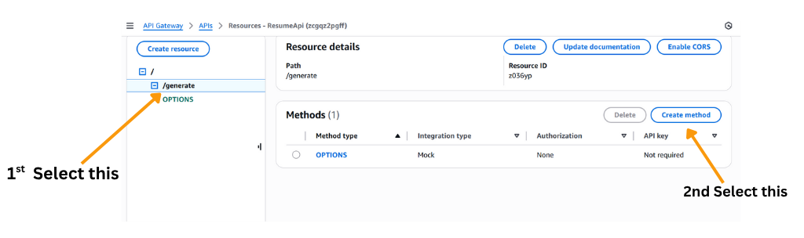

3.  From the dropdown, choose **POST**.
4.  Configure:
    *   **Integration type**: `Lambda Function`

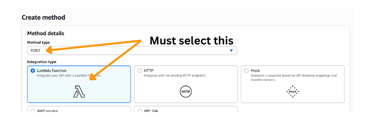

    *   **Use Lambda Proxy integration**: Enabled (allows the Lambda to access the full HTTP request data)
    *   **Lambda Function**: Select my function name (e.g., `ResumePdfFunction`)

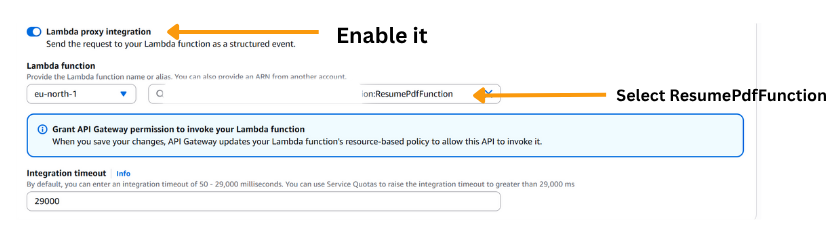

5.  Click **Save**.

### Enable CORS

1.  In the API Gateway, select the `/generate` resource.
2.  click **Actions** → **Enable CORS**.
3.  In the pop-up:
    *   Ensure `OPTIONS` and `POST` are selected.
    *   Set `Access-Control-Allow-Origin` to `*`.
4.  Click **Enable CORS and replace existing CORS headers**.

### Deploy API

1.  In API Gateway, click **Actions** → **Deploy API**.
2.  From the dropdown, select **[New Stage]**.

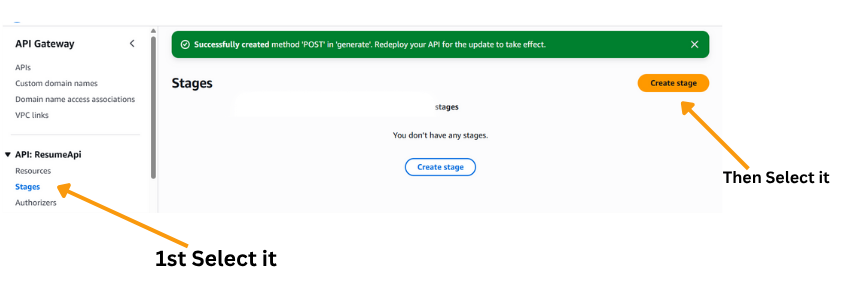

3.  Set **Stage name**: `prod`.
4.  Click **Create Stage**.
5.  After deployment, see an **Invoke URL** like:

```
https://your-api-id.execute-api.region.amazonaws.com/prod
```

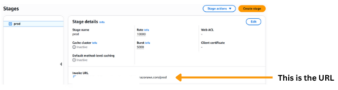

6.  In my `script.js` file, I use:

```
https://your-api-id.execute-api.region.amazonaws.com/prod/generate
```

API is now **live** and ready to accept requests!

## Connect Frontend with API

**Set API URL in `script.js`**


Replace the fetch URL in `script.js` with your API endpoint URL. This change directs form requests to the Lambda function through API Gateway.

## Configure CloudFront and WAF

**Purpose:** **Amazon CloudFront** is a content delivery network **(CDN)**(CDN) service used to deliver content, including websites, videos, and applications, to users globally with low latency and high transfer speeds.
**WAF** or web application firewall helps protect web applications by filtering and monitoring HTTP traffic between a web application and the Internet. It typically protects web applications from attacks such as cross-site forgery, cross-site-scripting (XSS), file inclusion, and SQL injection, among others.

### Create CloudFront Distribution

*   Go to **CloudFront Console**: In the AWS Management Console, search for CloudFront and click on **Create Distribution**.
*   Select **Origin Domain**:
    *   In the **Origin domain** field, click the dropdown.
    *   Select your S3 frontend bucket (e.g., `resume-builder-frontend`).
    *   CloudFront will automatically set this as the **origin**.
*   You’ve now connected CloudFront to your S3 **static website bucket**.

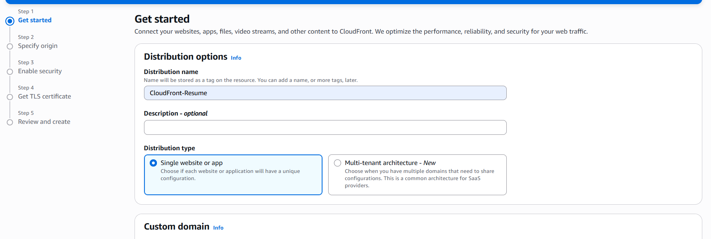

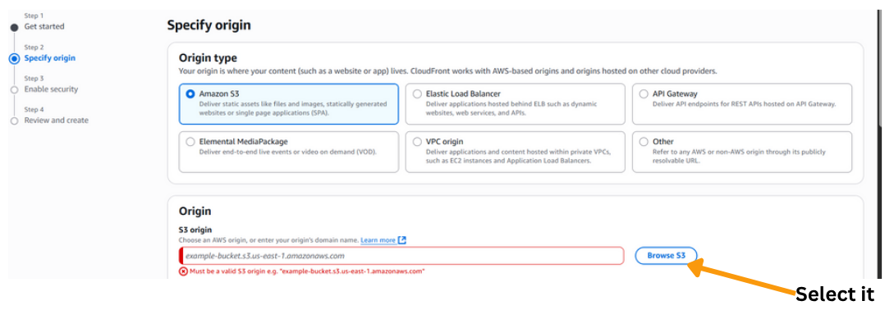

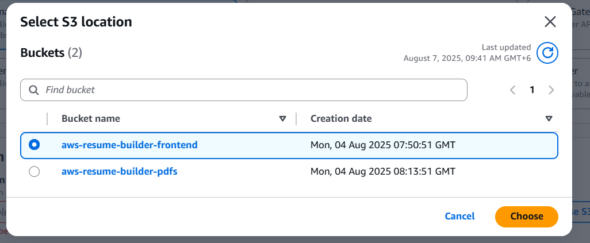

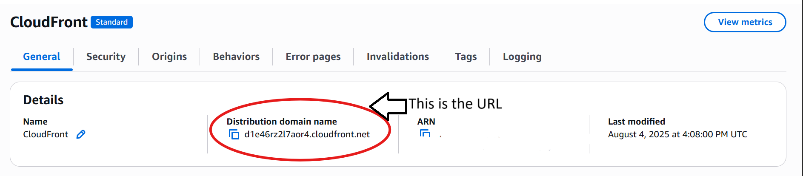

### WAF Setup for CloudFront

*   Open **WAF Console**: Go to AWS Console → Search **WAF & Shield** → Click **WAF**.
*   Create **Web ACL**:
    *   Click **Create web ACL**.
    *   Name: `resume-builder-waf`.
    *   Resource type: **CloudFront distributions**.
    *   Region: **Global** (CloudFront only) → Next.

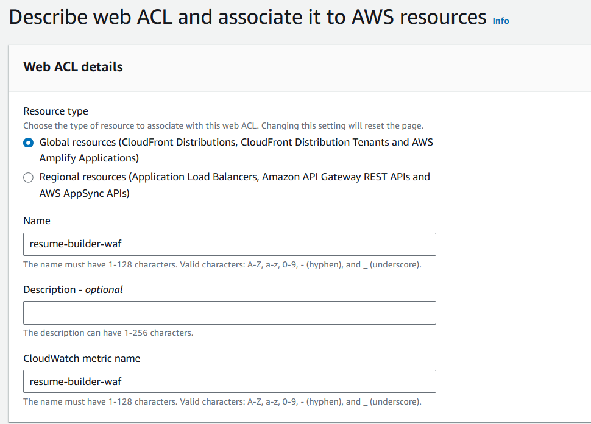

*   Add **Rule**:
    *   Choose **Add managed rule groups**.

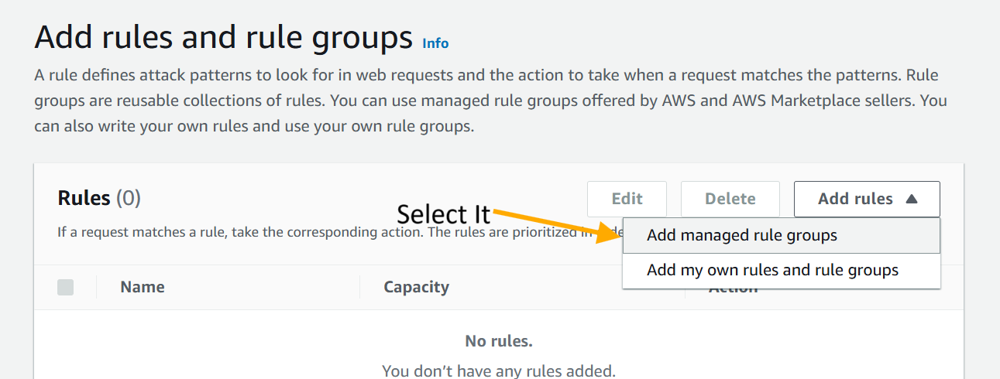

*   Associate with CloudFront:
    *   Select your CloudFront distribution under **Associated AWS resources**.

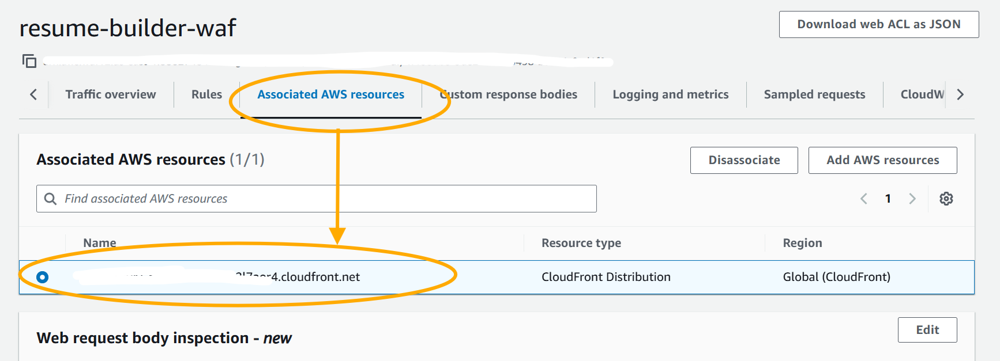

    *   **Save** and **confirm**.

## Detailed Analysis of CloudWatch & Budget Control

**Purpose:** This helps monitor logs and manage AWS costs effectively.

*   **Lambda execution logs:** View and analyze in **CloudWatch**.
*   **AWS Budgets:** Set up a budget (e.g., \$5).
*   **Notification:** When actual costs exceed 100% of the budget, an email alert is sent.

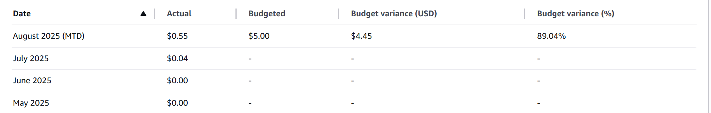

# Troubleshooting Guide

## Problem 1: Website not updating after frontend code changes

*   **Cause:** CloudFront was caching my static files (e.g., `script.js`, `style.css`). As a result, even when I uploaded a new file to the S3 bucket, CloudFront was still serving the old, cached version to users.
*   **Solution:** I went to the CloudFront console and created an *Invalidation* for my distribution. By invalidating specific files like `/index.html` and `/script.js`, CloudFront cleared the old files from its cache and started serving the new ones from S3.

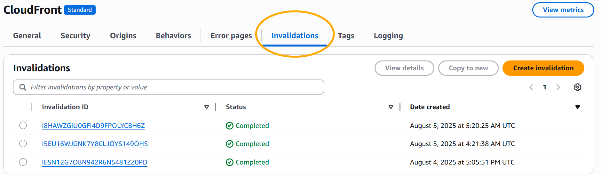

## Problem 2: Lambda deployment error - file too large

*   **Cause:** Deployment `.zip` exceeded Lambda’s 50 MB direct upload limit.
*   **Solution:** Instead of uploading the `.zip` file directly to Lambda, I first uploaded it to an S3 bucket. Then, from the Lambda console, I updated the code by providing the S3 Object URL. This worked perfectly.

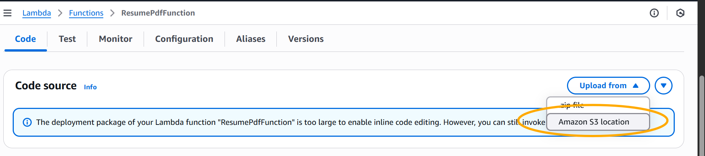

## Problem 3: net::ERR_CONNECTION_REFUSED error

*   **Cause:** The Invoke URL for my API Gateway in the `script.js` file was incorrect. I had either made a typo or omitted a crucial part of the URL, such as the `/prod/generate` path.
*   **Solution:** I opened my `script.js` file and replaced the incorrect URL with the correct Invoke URL copied from the API Gateway console. I made sure to include`/generate` at the end and then re-uploaded the file to S3.


# Final Output

After successful setup:

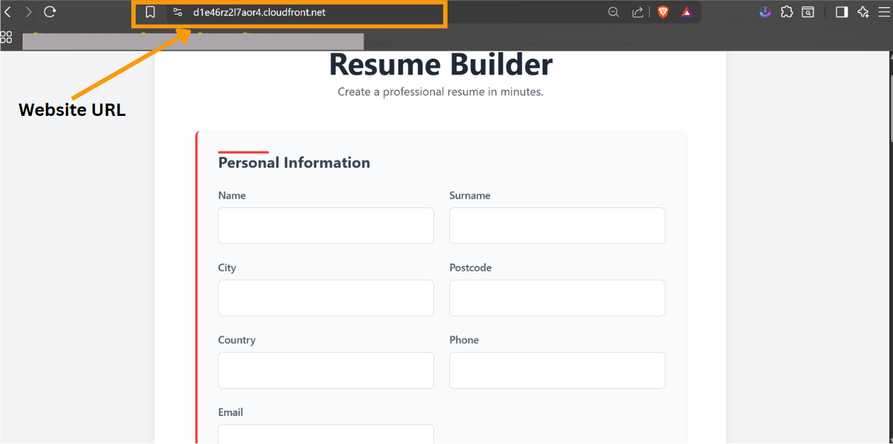

# Future Improvements

*   Add user login via Cognito
*   Support multiple resume templates
*   Track resume generation history
